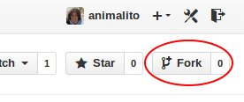

The everyday workflow
---------------------

The normal everyday workflow in git/github is fairly simple and soon enough should be ingrained in your brain.


Teamwork via git
----------------

One of the possible git distributed workflows is the [Integration Manager Workflow](http://git-scm.com/book/en/Distributed-Git-Distributed-Workflows#Integration-Manager-Workflow).

In this part, we will cover this type of workflow using forks.

###Exercise

1. Fork this repo. 

  

2. Clone your fork to your computer

  a. Copy the address of the repo (your fork) 

  
  
  b. Go to your terminal or git and write (in the folder where you want your repo)
  
    ```git
    git clone http_of_your_fork
    ```
3. Do 4 and 5 in your local computer.
4. Add a folder in your fork with your name inside the subdirectory *excercises*
5. Add a .txt file with "Hello world! -your name- is commiting to working now with github!"
6. Go to your terminal and follow your daily workflow

  ```git
  git pull
  git add .
  git status
  git commit -m "I commit to github"
  git push
  ```

7. See the changes in your github!

Basic commands
--------------

```git
git status
```
Status allows you to view what you have in your local machine, what is in the cloud, etc.

```git
git pull
```

Pulling is your way to connect to github. 

Keeping your fork update
------------------------

```
  > git remote -v
```
This command should show only `origin` pointing to your fork of this tutorial. A `remote` is a relate repository (with 
shared history) in which you can do `pull` or `push` as you do with your original.

Lets add the remote of this tutorial.

```
  > git remote add animalito https://github.com/animalito/github_tutorial.git
```

Execute again `git remote -v` and you will see `2` repos.

To make `pull` to the changes that are in `remote` `animalito` just do

```
  > git pull animalito master
```

Note that to `pull` from your `fork`, you still need only do `git pull`.

Si todo sale bien, ahora pueden hacer `push` a su `fork`. Esto mantendrá los cambios sincronizados.


